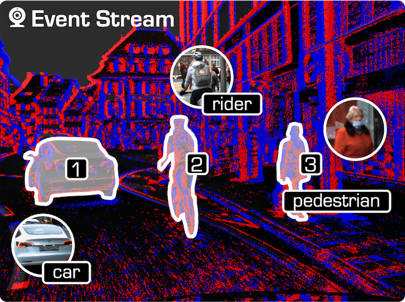
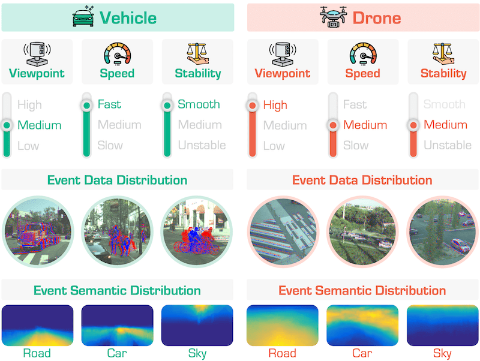

[](https://github.com/sindresorhus/awesome)
[](https://arxiv.org/abs/260x.xxxxx)

[](https://github.com/worldbench/awesome-event-camera-vision/pulls)

# :sunglasses: Awesome Event Camera Vision

This survey ...


For more details, kindly refer to our [paper](https://huggingface.co/papers/260x.xxxxx) and [project page](https://worldbench.github.io/awesome-event-camera-vision). :rocket:


### :books: Citation 

If you find this work helpful for your research, please kindly consider citing our papers:
```bib
@article{survey_event_camera,
    title   = {Recent Trends in Event Camera Vision: Perception, Reconstruction, and Understanding},
    author  = {Lingdong Kong and Haiqian Han and Lai Xing Ng and Xiangyang Ji and Wei Tsang Ooi and Benoit R. Cottereau},
    journal = {arXiv preprint arXiv:260x.xxxxx},
    year    = {2026}
}
```


### Table of Contents
- [**0. Background**](#background)
- [**1. Benchmarks \& Datasets**](#1-benchmarks--datasets)
    - [Benchmarks](#benchmarks)
    - [Workshops](#workshops)
    - [Datasets](#datasets)
- [**2. Event Camera Perception**](#2-event-camera-perception)
    -  [Event Camera Object Detection](#one-event-camera-object-detection)
    -  [Event Camera Semantic Segmentation](#two-event-camera-semantic-segmentation)
    -  [Event Camera Depth Estimation](#three-event-camera-depth-estimation)
    -  ...
    -  ...
- [**3. Event Camera Reconstruction**](#3-event-camera-reconstruction)
    -  ...
    -  ...
    -  ...
- [**4. Event Camera Understanding**](#4-event-camera-understanding)
    -  ...
    -  ...
    -  ...
- [**5. Applications**](#5-applications)
    -  ...
    -  ...
    -  ...
- [**6. Other Resources**](#6-other-resources)
    - [Tutorials](#tutorials)
    - [Talks \& Seminars](#talks--seminars)
    - [Relevant Surveys](#relevant-surveys)
- [**7. Acknowledgements**](#7-acknowledgements)


# Background

...


# 1. Benchmarks & Datasets

### Benchmarks

|  |  |  |
|:-:|:-:|:-:|
| [**Talk2Event**](https://talk2event.github.io/) | [**E-Deflare**](https://e-flare.github.io/) | [**EventFly**](https://event-fly.github.io/) | 
| [...]() |


### Workshops

| Theme | Venue | Date | Location | Recording |
|:-|:-:|:-:|:-:|:-:|
| [Workshop on Neuromorphic Perception for Real World Robotics (NeuRobots)](https://sites.google.com/view/neurobots2025) | IROS 2025 | October 24, 2025 | Hangzhou | [[YouTube](https://www.youtube.com/playlist?list=PL41Hj1v8NO3NjD6K8s-GAmypvUM41VpSS)] |
| [Workshop on Event-Based Vision](https://eventvision-robotics.github.io/iros_workshop/) | IROS 2025 | October 20, 2025 | Hangzhou | - |
| [The 2nd Workshop on Neuromorphic Vision (NeVi)](https://sites.google.com/view/nevi-2025/home-page) | ICCV 2025 | October 20, 2025 | Honolulu | - |
| [The 5th International Workshop on Event-Based Vision](https://tub-rip.github.io/eventvision2025/) | CVPR 2025 | June 12, 2025 | Nashville | - |
| [The 4th International Workshop on Event-Based Vision](https://tub-rip.github.io/eventvision2023/) | CVPR 2023 | June 19, 2023 | Vancouver | [[YouTube](https://www.youtube.com/playlist?list=PLeXWz-g2If96iotpzgBNNTr9VA6hG-LLK)] |
| [The 3rd International Workshop on Event-Based Vision](https://tub-rip.github.io/eventvision2021/) | CVPR 2021 | June 19, 2021 | Virtual | [[YouTube](https://www.youtube.com/playlist?list=PLeXWz-g2If95mjNpA-y-WIoDaoB8WtmE7)] |
| [The 2nd International Workshop on Event-Based Vision](https://rpg.ifi.uzh.ch/CVPR19_event_vision_workshop.html) | CVPR 2019 | June 17, 2019 | Long Beach | [[YouTube](https://www.youtube.com/playlist?list=PLeXWz-g2If97iGiuBHmnW8IFIxwvSeCHx)] |
| [The 1st International Workshop on Event-Based Vision](https://rpg.ifi.uzh.ch/ICRA17_event_vision_workshop.html) | ICRA 2017 | June 2, 2017 | Singapore | [[YouTube](https://www.youtube.com/playlist?list=PLeXWz-g2If94k8mw6GcKU5C9PUgM1sK0U)] |


### Datasets

> :timer_clock: In chronological order, from the earliest to the latest.

| Model | Paper | Venue | Website | GitHub |
|:-:|:-|:-:|:-:|:-:|
||
| `DSEC` | [](https://arxiv.org/abs/2103.06011)<br>DSEC: A Stereo Event Camera Dataset for Driving Scenarios | RA-L 2021 | [](https://dsec.ifi.uzh.ch/) | [](https://github.com/uzh-rpg/DSEC) |
| `DSEC-Semantic` |  | ECCV 2024 |  | [](https://github.com/uzh-rpg/ess) |
|  |
|  |


# 2. Event Camera Perception

### :one: Event Camera Object Detection

> :timer_clock: In chronological order, from the earliest to the latest.

| Model | Paper | Venue | Website | GitHub | 
|:-:|:-|:-:|:-:|:-:|
||
| `RVT` | [](https://arxiv.org/abs/2212.05598)<br>Recurrent Vision Transformers for Object Detection with Event Cameras | CVPR 2023 | - | [](https://github.com/uzh-rpg/RVT) | |
|  |
|  |


### :two: Event Camera Semantic Segmentation

> :timer_clock: In chronological order, from the earliest to the latest.

| Model | Paper | Venue | Website | GitHub | 
|:-:|:-|:-:|:-:|:-:|
||
|  |
|  |


### :three: Event Camera Depth Estimation

> :timer_clock: In chronological order, from the earliest to the latest.

| Model | Paper | Venue | Website | GitHub | 
|:-:|:-|:-:|:-:|:-:|
||
|  |
|  |


# 3. Event Camera Reconstruction

### :one: Event Camera Image Reconstruction

> :timer_clock: In chronological order, from the earliest to the latest.

| Model | Paper | Venue | Website | GitHub | 
|:-:|:-|:-:|:-:|:-:|
||
|  |
|  |


### :two: Event Camera 3D Reconstruction

> :timer_clock: In chronological order, from the earliest to the latest.

| Model | Paper | Venue | Website | GitHub | 
|:-:|:-|:-:|:-:|:-:|
||
|  |
|  |


# 4. Event Camera Understanding

### :one: 


# 5. Applications


# 6. Other Resources

### Tutorials

...


### Talks & Seminars

...


### Relevant Surveys

| Paper | Venue | Website | GitHub | 
|:-|:-:|:-:|:-:|
||
| [](https://arxiv.org/abs/1904.08405)<br>Event-Based Vision: A Survey | TPAMI 2022 | - | [](https://github.com/uzh-rpg/event-based_vision_resources) |
| [](https://arxiv.org/abs/2302.08890)<br>Deep Learning for Event-Based Vision: A Comprehensive Survey and Benchmarks | arXiv 2023 | - | [](https://github.com/vlislab22/Deep-Learning-for-Event-based-Vision) |
| [](https://arxiv.org/abs/2304.09793)<br>Event-Based Simultaneous Localization and Mapping: A Comprehensive Survey | arXiv 2023 | - | [](https://github.com/kun150kun/ESLAM-survey) |
| [](https://www.mdpi.com/2078-2489/15/8/472)<br>An Application-Driven Survey on Event-Based Neuromorphic Computer Vision | Information 2024 | - | - |
| [](https://ieeexplore.ieee.org/abstract/document/10494342/)<br>Event Cameras in Automotive Sensing: A Review | IEEE Access 2024 | - | - |
| [](https://arxiv.org/abs/2408.13627)<br>Recent Event Camera Innovations: A Survey | ECCV Workshop 2024 | - | [](https://github.com/chakravarthi589/Event-based-Vision_Resources) |
| [](https://arxiv.org/abs/2405.03995)<br>Deep Event-Based Object Detection in Autonomous Driving: A Survey | arXiv 2024 | - | - |
| [](https://arxiv.org/abs/2409.17680)<br>Event-Based Stereo Depth Estimation: A Survey | TPAMI 2025 | - | [](https://github.com/tub-rip/EventStereoSurvey) |
| [](https://www.mdpi.com/1424-8220/26/1/81)<br>Event-Based Vision Application on Autonomous Unmanned Aerial Vehicle: A Systematic Review of Prospects and Challenges | Sensors 2025 | - | - |
| [](https://dl.acm.org/doi/abs/10.1145/3786332)<br>Event Camera Meets Mobile Embodied Perception: Abstraction, Algorithm, Acceleration, Application | ACM Computing Surveys 2025 | - | - |
| [](https://arxiv.org/abs/2505.08438)<br>A Survey of 3D Reconstruction with Event Cameras | arXiv 2025 | - | - |
| [](https://arxiv.org/abs/2509.09971)<br>Event Camera Guided Visual Media Restoration & 3D Reconstruction: A Survey | arXiv 2025 | - | - |
|  |


# 7. Acknowledgements

To be added.
