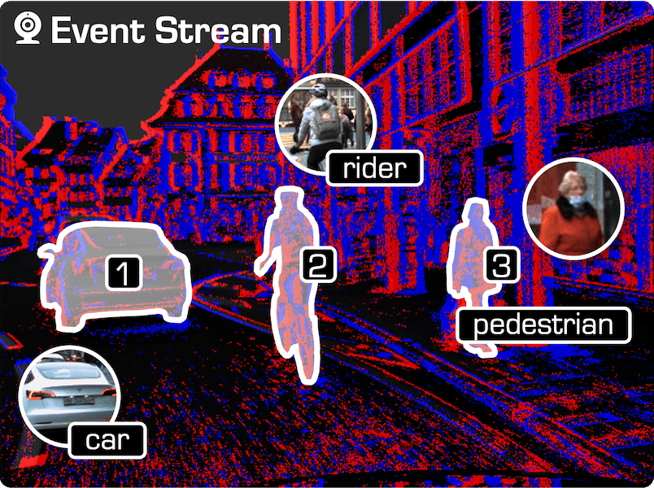
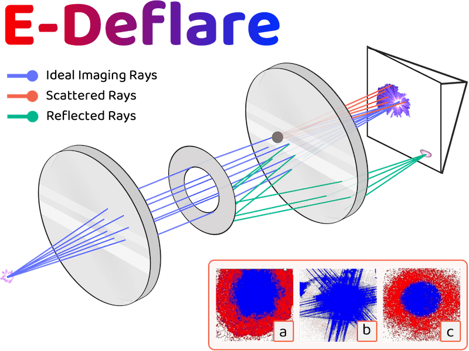
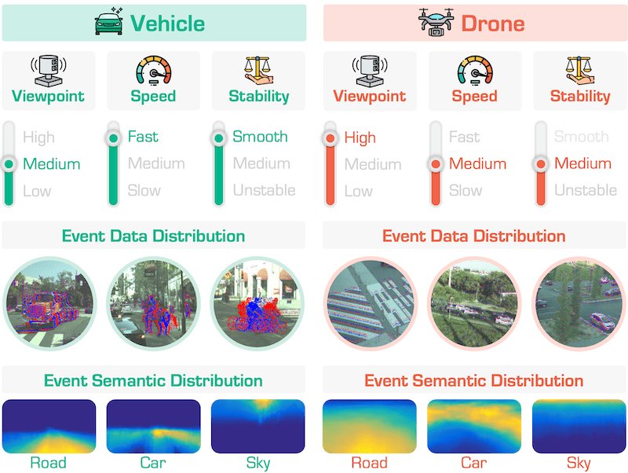

[](https://github.com/sindresorhus/awesome)
[](https://arxiv.org/abs/260x.xxxxx)

[](https://github.com/worldbench/awesome-event-camera-vision/pulls)

# :sunglasses: Awesome Event Camera Vision

This survey ...


For more details, kindly refer to our [paper](https://huggingface.co/papers/260x.xxxxx) and [project page](https://worldbench.github.io/awesome-event-camera-vision). :rocket:


### :books: Citation 

If you find this work helpful for your research, please kindly consider citing our papers:
```bib
@article{survey_event_camera,
    title   = {Event Camera Vision in the Era of Large Models: A Survey},
    author  = {Lingdong Kong and Haiqian Han and Lai Xing Ng and Xiangyang Ji and Wei Tsang Ooi and Benoit R. Cottereau},
    journal = {arXiv preprint arXiv:260x.xxxxx},
    year    = {2026}
}
```


### Table of Contents
- [**0. Background**](#background)
- [**2. Event Camera Perception**](#2-event-camera-perception)
    - [2.1 Object Detection](#21-object-detection)
        - [CNN, RNN \& Graph Approaches](#cnn-rnn--graph-approaches)
        - [Transformer \& Attention-Based](#transformer--attention-based)
        - [SNN \& Efficient Detection](#snn--efficient-detection)
    - [2.2 Semantic Segmentation](#22-semantic-segmentation)
        - [Supervised \& Multi-Modal Fusion](#supervised--multi-modal-fusion)
        - [Annotation-Efficient \& Adaptation](#annotation-efficient--adaptation)
        - [Motion \& Instance Segmentation](#motion--instance-segmentation)
    - [2.3 Depth \& Optical Flow Estimation](#23-depth--optical-flow-estimation)
        - [Monocular Depth Estimation](#monocular-depth-estimation)
        - [Stereo Depth Estimation](#stereo-depth-estimation)
        - [Optical Flow Estimation](#optical-flow-estimation)
    - [2.4 Object Tracking](#24-object-tracking)
        - [Frame-Event Tracking](#frame-event-tracking)
        - [Event-Only Tracking](#event-only-tracking)
        - [Long-Term \& Cross-Modal Tracking](#long-term--cross-modal-tracking)
    - [2.5 Action Recognition \& Pose Estimation](#25-action-recognition--pose-estimation)
        - [Action \& Gesture Recognition](#action--gesture-recognition)
        - [Body Pose Estimation](#body-pose-estimation)
        - [Hand \& Egocentric Pose Estimation](#hand--egocentric-pose-estimation)
- [**3. Event Camera Reconstruction**](#3-event-camera-reconstruction)
    - [3.1 Event-to-Video Reconstruction](#31-event-to-video-reconstruction)
        - [Discriminative Models](#discriminative-models)
        - [Generative Models](#generative-models)
        - [Self-Supervised Approaches](#self-supervised-approaches)
    - [3.2 Video Frame Interpolation \& Deblurring](#32-video-frame-interpolation--deblurring)
        - [Frame Interpolation](#frame-interpolation)
        - [Motion Deblurring](#motion-deblurring)
        - [Joint Interpolation \& Deblurring](#joint-interpolation--deblurring)
    - [3.3 Image Enhancement](#33-image-enhancement)
        - [Super-Resolution](#super-resolution)
        - [HDR Reconstruction](#hdr-reconstruction)
        - [Low-Light Enhancement](#low-light-enhancement)
    - [3.4 3D Reconstruction](#34-3d-reconstruction)
        - [Geometric \& Semi-Dense](#geometric--semi-dense)
        - [NeRF-Based](#nerf-based)
        - [3DGS-Based](#3dgs-based)
- [**4. Event Camera Understanding**](#4-event-camera-understanding)
    - [4.1 Open-Vocabulary Perception](#41-open-vocabulary-perception)
        - [Image-Level Recognition](#image-level-recognition)
        - [Dense Segmentation \& Detection](#dense-segmentation--detection)
        - [Self-Supervised Pre-training](#self-supervised-pre-training)
        - [Cross-Modal Transfer](#cross-modal-transfer)
    - [4.2 Scene Understanding \& Reasoning](#42-scene-understanding--reasoning)
        - [Event-Based MLLMs](#event-based-mllms)
        - [Visual Grounding \& Embodied Intelligence](#visual-grounding--embodied-intelligence)
        - [Language-Guided Recognition](#language-guided-recognition)
    - [4.3 Event Data Simulation \& Generation](#43-event-data-simulation--generation)
        - [Physics-Based Simulators](#physics-based-simulators)
        - [Learned \& Neural Generation](#learned--neural-generation)
        - [Sim-to-Real Transfer](#sim-to-real-transfer)
- [**5. Datasets \& Benchmarks**](#5-datasets--benchmarks)
    - [Benchmarks](#benchmarks)
    - [Workshops](#workshops)
    - [Datasets](#datasets)
    - [Simulators](#simulators)
- [**6. Challenges \& Future Directions**](#6-challenges--future-directions)
- [**7. Other Resources**](#7-other-resources)
    - [Tutorials](#tutorials)
    - [Talks \& Seminars](#talks--seminars)
    - [Relevant Surveys](#relevant-surveys)
- [**8. Acknowledgements**](#8-acknowledgements)


# Background

...


# 2. Event Camera Perception

## 2.1 Object Detection

### CNN, RNN & Graph Approaches

> :timer_clock: In chronological order, from the earliest to the latest.

| Model | Paper | Venue | Website | GitHub |
|:-:|:-|:-:|:-:|:-:|
| `DVS-Detection` | [](https://arxiv.org/abs/1709.09323)<br>Pseudo-Labels for Supervised Learning on Dynamic Vision Sensor Data, Applied to Object Detection under Ego-Motion | CVPRW 2018 | - | - |
| `YOLE` | [](https://arxiv.org/abs/1805.07931)<br>Asynchronous Convolutional Networks for Object Detection in Neuromorphic Cameras | CVPRW 2019 | - | - |
| `MatrixLSTM` | [](https://arxiv.org/abs/2009.13436)<br>Learning to Detect Objects with a 1 Megapixel Event Camera | NeurIPS 2020 | - | - |
| `ASTMNet` | [Asynchronous Spatio-Temporal Memory Network for Continuous Event-Based Object Detection](https://ieeexplore.ieee.org/document/9749022)<br>Asynchronous Spatio-Temporal Memory Network for Continuous Event-Based Object Detection | TIP 2022 | - | - |
| `AEGNN` | [](https://arxiv.org/abs/2203.17149)<br>AEGNN: Asynchronous Event-based Graph Neural Networks | CVPR 2022 | - | [](https://github.com/uzh-rpg/aegnn) |
| `RENet` | [](https://arxiv.org/abs/2209.08323)<br>RGB-Event Fusion for Moving Object Detection in Autonomous Driving | ICRA 2023 | - | [](https://github.com/ZZY-Zhou/RENet) |
| `DAGR` | Low-Latency Automotive Vision with Event Cameras | Nature 2024 | - | [](https://github.com/uzh-rpg/dagr) |
| `CDE-Net` | [](https://arxiv.org/abs/2309.09297)<br>Chasing Day and Night: Towards Robust and Efficient All-Day Object Detection Guided by an Event Camera | ICRA 2024 | - | - |
|  |
|  |


### Transformer & Attention-Based

> :timer_clock: In chronological order, from the earliest to the latest.

| Model | Paper | Venue | Website | GitHub |
|:-:|:-|:-:|:-:|:-:|
| `RVT` | [](https://arxiv.org/abs/2212.05598)<br>Recurrent Vision Transformers for Object Detection with Event Cameras | CVPR 2023 | - | [](https://github.com/uzh-rpg/RVT) |
| `SODFormer` | [](https://arxiv.org/abs/2308.04047)<br>SODFormer: Streaming Object Detection with Transformer Using Events and Frames | TPAMI 2023 | - | - |
| `GET` | [](https://arxiv.org/abs/2310.02642)<br>GET: Group Event Transformer for Event-Based Vision | ICCV 2023 | - | [](https://github.com/Peterande/GET-Group-Event-Transformer) |
| `LEOD` | [](https://arxiv.org/abs/2311.17286)<br>LEOD: Label-Efficient Object Detection for Event Cameras | CVPR 2024 | - | [](https://github.com/Wuziyi616/LEOD) |
| `State-Space` | [](https://arxiv.org/abs/2402.15584)<br>State Space Models for Event Cameras | CVPR 2024 (Spotlight) | - | [](https://github.com/uzh-rpg/ssms_event_cameras) |
| `SAST` | [](https://arxiv.org/abs/2404.01882)<br>Scene Adaptive Sparse Transformer for Event-based Object Detection | CVPR 2024 | - | [](https://github.com/Peterande/SAST) |
| `EMF` | [](https://arxiv.org/abs/2504.04124)<br>EMF: Event Meta Formers for Event-based Real-time Traffic Object Detection | arXiv 2025 | - | - |
|  |
|  |


### SNN & Efficient Detection

> :timer_clock: In chronological order, from the earliest to the latest.

| Model | Paper | Venue | Website | GitHub |
|:-:|:-|:-:|:-:|:-:|
| `SFOD` | [](https://arxiv.org/abs/2403.15192)<br>SFOD: Spiking Fusion Object Detector | CVPR 2024 | - | - |
| `MoE-HeatDet` | [](https://arxiv.org/abs/2412.06647)<br>Object Detection using Event Camera: A MoE Heat Conduction based Detector and A New Benchmark Dataset | CVPR 2025 | - | - |
| `EventFly` | EventFly: Event Camera Perception from Ground to the Sky | CVPR 2025 | [](https://event-fly.github.io/) | - |
| `OpenESS-Det` | [](https://arxiv.org/abs/2510.00681)<br>Adaptive Event Stream Slicing for Open-Vocabulary Event-Based Object Detection | arXiv 2025 | - | - |
| `EAS-SNN` | [](https://arxiv.org/abs/2403.12574)<br>EAS-SNN: End-to-End Adaptive Sampling and Representation for Event-based Detection with Recurrent Spiking Neural Networks | ECCV 2024 | - | - |
|  |
|  |


## 2.2 Semantic Segmentation

### Supervised & Multi-Modal Fusion

> :timer_clock: In chronological order, from the earliest to the latest.

| Model | Paper | Venue | Website | GitHub |
|:-:|:-|:-:|:-:|:-:|
| `EV-SegNet` | [](https://arxiv.org/abs/1811.12039)<br>EV-SegNet: Semantic Segmentation for Event-based Cameras | CVPRW 2019 | - | [](https://github.com/Shathe/Ev-SegNet) |
| `EvDistill` | [](https://arxiv.org/abs/2111.12341)<br>EvDistill: Asynchronous Events to End-task Learning via Bidirectional Reconstruction-guided Cross-modal Knowledge Distillation | CVPR 2021 | - | [](https://github.com/addisonwang2013/evdistill) |
| `ESS` | [](https://arxiv.org/abs/2203.10016)<br>ESS: Learning Event-based Semantic Segmentation from Still Images | ECCV 2022 | - | [](https://github.com/uzh-rpg/ess) |
| `EV-Transfer` | [](https://arxiv.org/abs/2109.02618)<br>Bridging the Gap between Events and Frames through Unsupervised Domain Adaptation | RA-L 2022 | - | [](https://github.com/uzh-rpg/rpg_ev-transfer) |
| `CMX` | [](https://arxiv.org/abs/2203.04838)<br>CMX: Cross-Modal Fusion for RGB-X Semantic Segmentation | TITS 2023 | - | [](https://github.com/huaaaliu/RGBX_Semantic_Segmentation) |
| `HMNet` | [](https://arxiv.org/abs/2305.17852)<br>Hierarchical Neural Memory Network for Low Latency Event Processing | CVPR 2023 | - | [](https://github.com/hamarh/HMNet_pth) |
| `HALSIE` | [](https://arxiv.org/abs/2211.10754)<br>HALSIE: Hybrid Approach to Learning Segmentation by Simultaneously Exploiting Image and Event Modalities | WACV 2024 | - | - |
| `EventSAM` | [](https://arxiv.org/abs/2312.16222)<br>Segment Any Event Streams via Weighted Adaptation of Pivotal Tokens | CVPR 2024 | - | [](https://github.com/zhiwen-xdu/EventSAM) |
| `SAM-E-Adapter` | SAM-Event-Adapter: Adapting Segment Anything Model for Event-RGB Semantic Segmentation | ICRA 2024 | - | - |
| `OpenESS` | [](https://arxiv.org/abs/2405.05259)<br>OpenESS: Event-Based Semantic Scene Understanding with Open Vocabularies | CVPR 2024 (Highlight) | - | [](https://github.com/ldkong1205/OpenESS) |
| `EvSAM` | EvSAM: Segment Anything Model with Event-based Assistance | ACM TOMM 2025 | - | - |
| `OVOSE` | [](https://arxiv.org/abs/2408.09424)<br>OVOSE: Open-Vocabulary Semantic Segmentation in Event-Based Cameras | arXiv 2024 | - | - |
| `SEAL` | [](https://arxiv.org/abs/2601.23159)<br>Segment Any Events with Language | ICLR 2026 | - | - |
| `CMDA` | [](https://arxiv.org/abs/2307.15942)<br>CMDA: Cross-Modality Domain Adaptation for Nighttime Semantic Segmentation | ICCV 2023 | - | - |
| `MUSES` | [](https://arxiv.org/abs/2401.12761)<br>MUSES: The Multi-Sensor Semantic Perception Dataset for Driving under Uncertainty | ECCV 2024 | - | - |
| `SLTNet` | [](https://arxiv.org/abs/2412.12843)<br>SLTNet: Efficient Event-based Semantic Segmentation with Spike-driven Lightweight Transformer-based Networks | IROS 2025 | - | - |
|  |
|  |


### Annotation-Efficient & Adaptation

> :timer_clock: In chronological order, from the earliest to the latest.

| Model | Paper | Venue | Website | GitHub |
|:-:|:-|:-:|:-:|:-:|
| `HPL-ESS` | HPL-ESS: Hybrid Pseudo-Labeling for Unsupervised Event-Based Semantic Segmentation | CVPR 2024 | - | - |
| `EV-WSSS` | [](https://arxiv.org/abs/2407.11216)<br>Finding Meaning in Points: Weakly Supervised Semantic Segmentation for Event Cameras | ECCV 2024 | - | - |
| `EvLowLightSeg` | [](https://arxiv.org/abs/2411.00639)<br>Event-guided Low-light Video Semantic Segmentation | WACV 2025 | - | - |
|  |
|  |


### Motion & Instance Segmentation

> :timer_clock: In chronological order, from the earliest to the latest.

| Model | Paper | Venue | Website | GitHub |
|:-:|:-|:-:|:-:|:-:|
| `EV-IMO` | EV-IMO: Motion Segmentation Dataset and Learning Pipeline for Event Cameras | IROS 2019 | - | - |
| `EMSGC` | [](https://arxiv.org/abs/2012.08730)<br>Event-Based Motion Segmentation with Spatio-Temporal Graph Cuts | TNNLS 2021 | - | - |
| `Un-EvMoSeg` | Unsupervised Event-Based Independent Motion Segmentation | ECCV 2024 | - | - |
| `OutOfRoom` | [](https://arxiv.org/abs/2403.04562)<br>Out of the Room: Generalizing Event-Based Dynamic Motion Segmentation for Complex Scenes | 3DV 2024 | - | - |
| `MouseSIS` | [](https://arxiv.org/abs/2409.03358)<br>MouseSIS: A Frames-and-Events Dataset for Space-Time Instance Segmentation of Mice | ECCVW 2024 | - | - |
|  |
|  |


## 2.3 Depth & Optical Flow Estimation

### Monocular Depth Estimation

> :timer_clock: In chronological order, from the earliest to the latest.

| Model | Paper | Venue | Website | GitHub |
|:-:|:-|:-:|:-:|:-:|
| `EMDE` | [](https://arxiv.org/abs/2203.12270)<br>Event-Based Dense Reconstruction Pipeline | ICRAS 2022 | - | - |
| `E2Depth` | [](https://arxiv.org/abs/2010.08350)<br>Learning Monocular Dense Depth from Events | 3DV 2020 | - | [](https://github.com/uzh-rpg/rpg_e2depth) |
| `RAM-Net` | [](https://arxiv.org/abs/2102.09320)<br>Combining Events and Frames using Recurrent Asynchronous Multimodal Networks for Monocular Depth Prediction | RA-L 2021 | - | [](https://github.com/uzh-rpg/rpg_ramnet) |
| `HMNet-Depth` | [](https://arxiv.org/abs/2305.17852)<br>Hierarchical Neural Memory Network for Low Latency Event Processing | CVPR 2023 | - | [](https://github.com/hamarh/HMNet_pth) |
| `EReFormer` | [](https://arxiv.org/abs/2212.02791)<br>Event-based Monocular Depth Estimation with Recurrent Transformers | ECCV 2024 | - | [](https://github.com/liuxu0303/EReFormer) |
| `EMoDE` | [](https://arxiv.org/abs/2412.19067)<br>Learning Monocular Depth from Events via Egomotion Compensation | arXiv 2024 | - | - |
| `Depth AnyEvent` | Depth Any Event Stream: Enhancing Event-based Monocular Depth Estimation via Dense-to-Sparse Distillation | ICCV 2025 | - | - |
| `OnDevice-Depth` | [](https://arxiv.org/abs/2412.06359)<br>On-Device Self-Supervised Learning of Low-Latency Monocular Depth from Only Events | CVPR 2025 | - | - |
| `FUSE` | [](https://arxiv.org/abs/2503.19739)<br>FUSE: Label-Free Image-Event Joint Monocular Depth Estimation via Frequency-Decoupled Alignment and Degradation-Robust Fusion | IROS 2025 | - | - |
| `DERD-Net` | [](https://arxiv.org/abs/2504.15863)<br>DERD-Net: Learning Depth from Event-based Ray Densities | NeurIPS 2025 | - | - |
|  |
|  |

### Stereo Depth Estimation

> :timer_clock: In chronological order, from the earliest to the latest.

| Model | Paper | Venue | Website | GitHub |
|:-:|:-|:-:|:-:|:-:|
| `MVSEC-Stereo` | [](https://arxiv.org/abs/1801.10202)<br>The Multi Vehicle Stereo Event Camera Dataset: An Event Camera Dataset for 3D Perception | RA-L 2018 | - | - |
| `StereoSpike` | [](https://arxiv.org/abs/2109.13751)<br>StereoSpike: Depth Learning with a Spiking Neural Network | arXiv 2021 | - | - |
| `DSGN-Event` | Discrete Time Convolution for Fast Event-based Stereo | CVPR 2022 | - | - |
| `SDE-Net` | Selection and Cross Similarity for Event-Image Deep Stereo | ECCV 2022 | - | [](https://github.com/Chohoonhee/SCSNet) |
| `EvAC3D` | [](https://arxiv.org/abs/2309.09513)<br>Learning Parallax for Stereo Event-Based Motion Deblurring | ICCV 2023 | - | - |
| `E-Stereo-FUDA` | [](https://arxiv.org/abs/2210.08927)<br>Event-Based Stereo Depth Estimation from Ego-Motion using Ray Density Fusion | ECCV 2024 | - | - |
| `ESVO2` | [](https://arxiv.org/abs/2410.09374)<br>ESVO2: Direct Visual-Inertial Odometry with Stereo Event Cameras | TRO 2025 | - | - |
| `URNet` | [](https://arxiv.org/abs/2509.18184)<br>URNet: Uncertainty-aware Refinement Network for Event-based Stereo Depth Estimation | Visual Intelligence 2025 | - | - |
|  |
|  |


### Optical Flow Estimation

> :timer_clock: In chronological order, from the earliest to the latest.

| Model | Paper | Venue | Website | GitHub |
|:-:|:-|:-:|:-:|:-:|
| `EV-FlowNet` | [](https://arxiv.org/abs/1802.06898)<br>EV-FlowNet: Self-Supervised Optical Flow Estimation for Event-based Cameras | RSS 2018 | - | - |
| `Spike-FlowNet` | [](https://arxiv.org/abs/2003.06696)<br>Spike-FlowNet: Event-Driven Optical Flow Estimation with Energy-Efficient Hybrid Neural Networks | ECCV 2020 | - | [](https://github.com/chan8972/Spike-FlowNet) |
| `E-RAFT` | [](https://arxiv.org/abs/2108.10552)<br>E-RAFT: Dense Optical Flow from Event Cameras | 3DV 2022 | - | [](https://github.com/uzh-rpg/E-RAFT) |
| `DCEIFlow` | [](https://arxiv.org/abs/2211.09078)<br>Learning Dense and Continuous Optical Flow from an Event Camera | TIP 2022 | - | [](https://github.com/danqu130/DCEIFlow) |
| `BlinkFlow` | [](https://arxiv.org/abs/2303.07716)<br>BlinkFlow: A Dataset to Push the Limits of Event-based Optical Flow Estimation | IROS 2023 | - | - |
| `EGMBA` | [](https://arxiv.org/abs/2503.03307)<br>Full-DoF Egomotion Estimation for Event Cameras Using Geometric Solvers | CVPR 2025 | - | [](https://github.com/jizhaox/relpose-event) |
| `MeshFlow` | [](https://arxiv.org/abs/2510.04111)<br>Learning Efficient Meshflow and Optical Flow from Event Cameras | TPAMI 2025 | - | - |
| `NMGNet` | [](https://arxiv.org/abs/2505.05089)<br>Nonlinear Motion-Guided and Spatio-Temporal Aware Network for Unsupervised Event-Based Optical Flow | ICRA 2025 | - | - |
|  |
|  |


## 2.4 Object Tracking

### Frame-Event Tracking

> :timer_clock: In chronological order, from the earliest to the latest.

| Model | Paper | Venue | Website | GitHub |
|:-:|:-|:-:|:-:|:-:|
| `FE108-Track` | [](https://arxiv.org/abs/2109.09052)<br>Object Tracking by Jointly Exploiting Frame and Event Domain | ICCV 2021 | - | - |
| `CEUTrack` | [](https://arxiv.org/abs/2211.11010)<br>Revisiting Color-Event based Tracking: A Unified Network, Dataset, and Metric | PR 2025 | - | - |
| `AFNet` | [](https://arxiv.org/abs/2305.15688)<br>Frame-Event Alignment and Fusion Network for High Frame Rate Tracking | CVPR 2024 | - | - |
| `EventVOT-Track` | [](https://arxiv.org/abs/2309.14611)<br>Event Stream-based Visual Object Tracking: A High-Resolution Benchmark Dataset and A Novel Baseline | CVPR 2024 | - | - |
| `Asyn-MOT` | [](https://arxiv.org/abs/2505.08126)<br>Asynchronous Multi-Object Tracking with an Event Camera | ICRA 2025 | - | - |
|  |
|  |


### Event-Only Tracking

> :timer_clock: In chronological order, from the earliest to the latest.

| Model | Paper | Venue | Website | GitHub |
|:-:|:-|:-:|:-:|:-:|
| `STNet` | Spiking Transformers for Event-Based Single Object Tracking | CVPR 2022 | - | [](https://github.com/Jee-King/CVPR2022_STNet) |
| `HDETrack` | [](https://arxiv.org/abs/2401.02826)<br>Cross-Resolution Object Tracking Using Unaligned Frame and Event Cameras | TMM 2025 | - | - |
| `eMoE-Tracker` | [](https://arxiv.org/abs/2406.20024)<br>Environmental MoE-based Transformer for Robust Event-Guided Object Tracking | RA-L 2024 | - | - |
| `MambaEVT` | [](https://arxiv.org/abs/2404.18174)<br>Mamba-FETrack: Frame-Event Tracking via State Space Model | arXiv 2024 | - | - |
| `HDETrack-V2` | [](https://arxiv.org/abs/2502.05574)<br>Event Stream-based Visual Object Tracking: HDETrack V2 and A High-Definition Benchmark | arXiv 2025 | - | - |
|  |
|  |


### Long-Term & Cross-Modal Tracking

> :timer_clock: In chronological order, from the earliest to the latest.

| Model | Paper | Venue | Website | GitHub |
|:-:|:-|:-:|:-:|:-:|
| `TETrack` | [](https://arxiv.org/abs/2403.05839)<br>Long-Term Visual Object Tracking with Event Cameras | arXiv 2024 | - | - |
| `SiamEFT` | SiamEFT: Adaptive-Time Feature Extraction Hybrid Network for RGBE Multi-Domain Object Tracking | Front. Neurosci. 2024 | - | - |
| `EventFly-Track` | EventFly: Event Camera Perception from Ground to the Sky | CVPR 2025 | [](https://event-fly.github.io/) | - |
| `TUMTraf-EMOT` | [](https://arxiv.org/abs/2512.14595)<br>TUMTraf EMOT: Event-Based Multi-Object Tracking Dataset and Baseline for Traffic Scenarios | arXiv 2025 | - | - |
|  |
|  |


## 2.5 Action Recognition & Pose Estimation

### Action & Gesture Recognition

> :timer_clock: In chronological order, from the earliest to the latest.

| Model | Paper | Venue | Website | GitHub |
|:-:|:-|:-:|:-:|:-:|
| `DVS-Gesture` | A Low Power, Fully Event-Based Gesture Recognition System | CVPR 2017 | - | - |
| `PointNet-EVS` | [IEEE Paper](https://ieeexplore.ieee.org/document/8659288)<br>Space-Time Event Clouds for Gesture Recognition: From RGB Cameras to Event Cameras | CVPRW 2019 | - | - |
| `E2(GO)MOTION` | [](https://arxiv.org/abs/2112.03596)<br>E2(GO)MOTION: Motion Augmented Event Stream for Egocentric Action Recognition | CVPR 2022 | - | - |
| `ExACT` | [](https://arxiv.org/abs/2403.12534)<br>ExACT: Language-guided Conceptual Reasoning and Uncertainty Estimation for Event-based Action Recognition | CVPR 2024 | - | - |
| `HARDVS-Method` | [](https://arxiv.org/abs/2211.09648)<br>HARDVS: Revisiting Human Activity Recognition with Dynamic Vision Sensors | AAAI 2024 | - | - |
| `DailyDVS-Method` | [](https://arxiv.org/abs/2407.05106)<br>DailyDVS-200: A Comprehensive Benchmark Dataset for Event-Based Action Recognition | ECCV 2024 | - | - |
| `EventFly-Action` | EventFly: Event Camera Perception from Ground to the Sky | CVPR 2025 | [](https://event-fly.github.io/) | - |
| `EventTransAct` | [](https://arxiv.org/abs/2308.13711)<br>EventTransAct: A video transformer-based framework for Event-camera based action recognition | IROS 2023 | - | - |
| `SpikePoint` | [](https://arxiv.org/abs/2310.07189)<br>SpikePoint: An Efficient Point-based Spiking Neural Network for Event Cameras Action Recognition | ICLR 2024 | - | - |
| `Bullying10K` | [](https://arxiv.org/abs/2306.11546)<br>Bullying10K: A Large-Scale Neuromorphic Dataset towards Privacy-Preserving Bullying Recognition | NeurIPS 2023 | - | - |
| `PASS` | [](https://arxiv.org/abs/2409.16953)<br>PASS: Path-selective State Space Model for Event-based Recognition | NeurIPS 2025 | - | - |
|  |
|  |


### Body Pose Estimation

> :timer_clock: In chronological order, from the earliest to the latest.

| Model | Paper | Venue | Website | GitHub |
|:-:|:-|:-:|:-:|:-:|
| `DHP19-Method` | DHP19: Dynamic Vision Sensor 3D Human Pose Dataset | CVPRW 2019 | - | - |
| `EventCap` | [](https://arxiv.org/abs/1908.11505)<br>EventCap: Monocular 3D Capture of High-Speed Human Motions using an Event Camera | CVPR 2020 | - | - |
| `EventHPE` | Lifting Monocular Events to 3D Human Poses | CVPR 2021 | - | - |
| `EventEgo3D` | [](https://arxiv.org/abs/2404.08640)<br>EventEgo3D: 3D Human Motion Capture from Egocentric Event Streams | CVPR 2024 | - | - |
| `E-POSE` | E-POSE: A Large Scale Event Camera Dataset for Object Pose Estimation | Sci. Data 2025 | - | - |
| `EHPT-XC` | A Benchmark Dataset for Event-Guided Human Pose Estimation and Tracking in Extreme Conditions | NeurIPS 2024 | - | - |
| `SSTFormer` | [](https://arxiv.org/abs/2303.09681)<br>Highly Efficient 3D Human Pose Tracking from Events with Spiking Spatiotemporal Transformer | TCSVT 2023 | - | - |
|  |
|  |


### Hand & Egocentric Pose Estimation

> :timer_clock: In chronological order, from the earliest to the latest.

| Model | Paper | Venue | Website | GitHub |
|:-:|:-|:-:|:-:|:-:|
| `EvHandPose` | [](https://arxiv.org/abs/2303.02862)<br>EvHandPose: Event-based 3D Hand Pose Estimation with Sparse Supervision | TPAMI 2024 | - | - |
| `EventHandPose` | Complementing Event Streams and RGB Frames for Hand Mesh Reconstruction | ICCV 2023 | - | - |
| `EvRGBHand` | EvRGBHand: Complementing Event Streams and RGB Frames for Hand Mesh Reconstruction | CVPR 2024 | - | - |
| `InterHand-Event` | [](https://arxiv.org/abs/2312.14157)<br>3D Pose Estimation of Two Interacting Hands from a Monocular Event Camera | 3DV 2024 | - | - |
|  |
|  |


# 3. Event Camera Reconstruction

> See [Section 5: Datasets & Benchmarks](#5-datasets--benchmarks) for reconstruction-specific datasets.


## 3.1 Event-to-Video Reconstruction

### Discriminative Models

> :timer_clock: In chronological order, from the earliest to the latest.

| Model | Paper | Venue | Website | GitHub |
|:-:|:-|:-:|:-:|:-:|
| `E2VID` | [](https://arxiv.org/abs/1904.08298)<br>Events-to-Video: Bringing Modern Computer Vision to Event Cameras | CVPR 2019 | - | [](https://github.com/uzh-rpg/rpg_e2vid) |
| `E2VID+` | [](https://arxiv.org/abs/2003.09078)<br>Reducing the Sim-to-Real Gap for Event Cameras | ECCV 2020 | [](https://timostoff.github.io/20ecnn) | [](https://github.com/TimoStoff/event_cnn_minimal) |
| `SPADE-E2VID` | [IEEE Paper](https://ieeexplore.ieee.org/abstract/document/9337171)<br>SPADE-E2VID: Spatially-Adaptive Denormalization for Event-Based Video Reconstruction | TIP 2021 | - | [](https://github.com/RodrigoGantier/SPADE_E2VID) |
| `ET-Net` | [ICCV Paper](https://openaccess.thecvf.com/content/ICCV2021/papers/Weng_Event-Based_Video_Reconstruction_Using_Transformer_ICCV_2021_paper.pdf)<br>Event-based Video Reconstruction Using Transformer | ICCV 2021 | - | [](https://github.com/warranweng/et-net) |
| `EVSNN` | [](https://arxiv.org/abs/2201.10943)<br>Event-based Video Reconstruction via Potential-assisted Spiking Neural Network | CVPR 2022 | - | [](https://github.com/LinZhu111/EVSNN) |
| `E-SAI` | [TPAMI Paper](https://ieeexplore.ieee.org/document/9740355)<br>Learning to See Through with Events | TPAMI 2023 | [](https://dvs-whu.cn/projects/esai/) | [](https://github.com/dvs-whu/E-SAI) |
| `HyperE2VID` | [](https://arxiv.org/abs/2305.06382)<br>HyperE2VID: Improving Event-Based Video Reconstruction via Hypernetworks | TIP 2024 | - | [](https://github.com/ercanburak/HyperE2VID) |
| `STLR` | [ECCV Paper](https://www.ecva.net/papers/eccv_2024/papers_ECCV/papers/05843.pdf)<br>Spike-temporal Latent Representation for Energy-Efficient Event-to-Video Reconstruction | ECCV 2024 | - | - |
| `PPLNs` | [](https://arxiv.org/abs/2409.19772)<br>PPLNs: Parametric Piecewise Linear Networks for Event-Based Temporal Modeling and Beyond | NeurIPS 2024 | - | [](https://github.com/chensong1995/PPLN) |
| `MamEVSR` | [CVPR Paper](https://openaccess.thecvf.com/content/CVPR2025/papers/Xiao_Event-based_Video_Super-Resolution_via_State_Space_Models_CVPR_2025_paper.pdf)<br>Event-based Video Super-Resolution via State Space Models | CVPR 2025 | - | - |
| `Coded-E2LF` | [](https://arxiv.org/abs/2602.22620)<br>Coded-E2LF: Coded Aperture Light Field Imaging from Events | CVPR 2026 | - | - |
|  |
|  |


### Generative Models

> :timer_clock: In chronological order, from the earliest to the latest.

| Model | Paper | Venue | Website | GitHub |
|:-:|:-|:-:|:-:|:-:|
| `cGAN-E2V` | [CVPR Paper](https://openaccess.thecvf.com/content_CVPR_2019/papers/Wang_Event-Based_High_Dynamic_Range_Image_and_Very_High_Frame_Rate_CVPR_2019_paper.pdf)<br>Event-Based High Dynamic Range Image and Very High Frame Rate Video Generation Using Conditional Generative Adversarial Networks | CVPR 2019 | - | - |
| `E2VIDiff` | [](https://arxiv.org/abs/2407.08231)<br>E2VIDiff: Perceptual Events-to-Video Reconstruction using Diffusion Priors | arXiv 2024 | - | - |
| `TRG-Diffusion` | [ECCV Paper](https://www.ecva.net/papers/eccv_2024/papers_ECCV/papers/05690.pdf)<br>Temporal Residual Guided Diffusion Framework for Event-Driven Video Reconstruction | ECCV 2024 | - | - |
| `LaSe-E2V` | [](https://arxiv.org/abs/2407.05547)<br>LaSe-E2V: Towards Language-guided Semantic-Aware Event-to-Video Reconstruction | arXiv 2024 | - | - |
| `EvDiff` | [](https://arxiv.org/abs/2511.17492)<br>EvDiff: High Quality Video with an Event Camera | arXiv 2025 | - | - |
| `DESSERT` | [](https://arxiv.org/abs/2512.17323)<br>DESSERT: Diffusion-based Event-driven Single-frame Synthesis via Residual Training | arXiv 2025 | - | - |
| `IE2Video` | [](https://arxiv.org/abs/2512.05240)<br>IE2Video: Adapting Pretrained Diffusion Models for Event-Based Video Reconstruction | arXiv 2025 | - | - |
| `UniE2F` | [](https://arxiv.org/abs/2602.19202)<br>UniE2F: A Unified Diffusion Framework for Event-to-Frame Reconstruction with Video Foundation Models | arXiv 2026 | - | - |
|  |
|  |


### Self-Supervised Approaches

> :timer_clock: In chronological order, from the earliest to the latest.

| Model | Paper | Venue | Website | GitHub |
|:-:|:-|:-:|:-:|:-:|
| - | [ECCV Paper](https://www.ecva.net/papers/eccv_2020/papers_ECCV/papers/123630647.pdf)<br>Learning to See in the Dark with Events | ECCV 2020 | - | - |
| - | [](https://arxiv.org/abs/2009.08283)<br>Back to Event Basics: Self-Supervised Learning of Image Reconstruction for Event Cameras via Photometric Constancy | CVPR 2021 | - | - |
| `EvDeraining` | [ICCV Paper](https://openaccess.thecvf.com/content/ICCV2023/papers/Wang_Unsupervised_Video_Deraining_with_An_Event_Camera_ICCV_2023_paper.pdf)<br>Unsupervised Video Deraining with an Event Camera | ICCV 2023 | - | [](https://github.com/booker-max/Unsupervised-Deraining-with-Event-Camera) |
| `EvINR` | [](https://arxiv.org/abs/2407.18500)<br>Revisit Event Generation Model: Self-Supervised Learning of Event-to-Video Reconstruction with Implicit Neural Representations | ECCV 2024 | [](https://vlislab22.github.io/EvINR/) | [](https://github.com/wzpscott/EvINR) |
| `EVDI++` | [](https://arxiv.org/abs/2509.08260)<br>EVDI++: Event-based Video Deblurring and Interpolation via Self-Supervised Learning | arXiv 2025 | - | - |
|  |
|  |


## 3.2 Video Frame Interpolation & Deblurring

### Frame Interpolation

> :timer_clock: In chronological order, from the earliest to the latest.

| Model | Paper | Venue | Website | GitHub |
|:-:|:-|:-:|:-:|:-:|
| `TimeLens` | [CVPR Paper](https://openaccess.thecvf.com/content/CVPR2021/html/Tulyakov_Time_Lens_Event-Based_Video_Frame_Interpolation_CVPR_2021_paper.html)<br>TimeLens: Event-based Video Frame Interpolation | CVPR 2021 | [](https://rpg.ifi.uzh.ch/TimeLens.html) | [](https://github.com/uzh-rpg/rpg_timelens) |
| `TimeReplayer` | [](https://arxiv.org/abs/2203.13859)<br>TimeReplayer: Unlocking the Potential of Event Cameras for Video Interpolation | CVPR 2022 | [](https://sites.google.com/view/timereplayer) | - |
| `CBMNet` | [CVPR Paper](https://openaccess.thecvf.com/content/CVPR2023/html/Kim_Event-Based_Video_Frame_Interpolation_With_Cross-Modal_Asymmetric_Bidirectional_Motion_Fields_CVPR_2023_paper.html)<br>Event-Based Video Frame Interpolation With Cross-Modal Asymmetric Bidirectional Motion Fields | CVPR 2023 | - | [](https://github.com/intelpro/CBMNet) |
| `REFID` | [](https://arxiv.org/abs/2301.05191)<br>Event-Based Frame Interpolation with Ad-hoc Deblurring | CVPR 2023 | - | [](https://github.com/AHupuJR/REFID) |
| `Revisit-EBVFI` | [](https://arxiv.org/abs/2307.12558)<br>Revisiting Event-Based Video Frame Interpolation | IROS 2023 | [](https://jiabenchen.github.io/revisit_event) | - |
| `SuperFast` | [IEEE Paper](https://ieeexplore.ieee.org/document/9962797)<br>SuperFast: 200x Video Frame Interpolation via Event Camera | TPAMI 2023 | - | [](https://github.com/lisiqi19971013/SuperFast) |
| `EVFI-DS` | [CVPR Paper](https://openaccess.thecvf.com/content/CVPR2024/html/Liu_Video_Frame_Interpolation_via_Direct_Synthesis_with_the_Event-based_Reference_CVPR_2024_paper.html)<br>Video Frame Interpolation via Direct Synthesis with the Event-based Reference | CVPR 2024 | - | - |
| `TimeLens-XL` | [ECCV Paper](https://link.springer.com/chapter/10.1007/978-3-031-73226-3_11)<br>TimeLens-XL: Real-Time Event-Based Video Frame Interpolation with Large Motion | ECCV 2024 | [](https://openimaginglab.github.io/TimeLens-XL/) | [](https://github.com/OpenImagingLab/TimeLens-XL) |
| `REVDM` | [CVPR Paper](https://openaccess.thecvf.com/content/CVPR2025/html/Chen_Repurposing_Pre-trained_Video_Diffusion_Models_for_Event-based_Video_Interpolation_CVPR_2025_paper.html)<br>Repurposing Pre-trained Video Diffusion Models for Event-based Video Interpolation | CVPR 2025 | [](https://vdm-evfi.github.io/) | [](https://github.com/codingrex/VDM_EVFI) |
| `EIF-BiOFNet` | [](https://arxiv.org/abs/2502.13716)<br>Event-Based Video Frame Interpolation With Cross-Modal Asymmetric Bidirectional Motion Fields | CVPR 2025 (Highlight) | - | [](https://github.com/intelpro/CBMNet) |
| `TimeTracker` | [](https://arxiv.org/abs/2505.03116)<br>TimeTracker: Event-based Continuous Point Tracking for Video Frame Interpolation with Non-linear Motion | CVPR 2025 | - | - |
| `EventDiff` | [](https://arxiv.org/abs/2505.08235)<br>EventDiff: A Unified and Efficient Diffusion Model Framework for Event-based Video Frame Interpolation | arXiv 2025 | - | - |
|  |
|  |


### Motion Deblurring

> :timer_clock: In chronological order, from the earliest to the latest.

| Model | Paper | Venue | Website | GitHub |
|:-:|:-|:-:|:-:|:-:|
| `mEDI` | [IEEE Paper](https://ieeexplore.ieee.org/abstract/document/9252186)<br>Bringing a Blurry Frame Alive at High Frame-Rate with an Event Camera | CVPR 2019 | - | [](https://github.com/panpanfei/Bringing-a-Blurry-Frame-Alive-at-High-Frame-Rate-with-an-Event-Camera) |
| `EFNet` | [ECCV Paper](https://www.ecva.net/papers/eccv_2022/papers_ECCV/papers/136780403.pdf)<br>Event-Based Fusion for Motion Deblurring with Cross-modal Attention | ECCV 2022 | [](https://ahupujr.github.io/EFNet/) | [](https://github.com/AHupuJR/EFNet) |
| `SAN` | [](https://arxiv.org/abs/2308.05932)<br>Generalizing Event-Based Motion Deblurring in Real-World Scenarios | ICCV 2023 | - | [](https://github.com/xiangz-0/gem) |
| `DA-Deblur` | [ECCV Paper](https://www.ecva.net/papers/eccv_2024/papers_ECCV/papers/06299.pdf)<br>Motion Aware Event Representation-Driven Image Deblurring | ECCV 2024 | - | [](https://github.com/ZhijingS/DA_event_deblur) |
| `ELEDNet` | [ECCV Paper](https://link.springer.com/chapter/10.1007/978-3-031-73254-6_25)<br>Towards Real-World Event-Guided Low-Light Video Enhancement and Deblurring | ECCV 2024 | - | [](https://github.com/intelpro/ELEDNet) |
| `CMTA` | [](https://arxiv.org/abs/2408.14930)<br>CMTA: Cross-Modal Temporal Alignment for Event-guided Video Deblurring | ECCV 2024 | - | - |
| `EGDeblurring` | [CVPR Paper](https://openaccess.thecvf.com/content/CVPR2025/html/Xie_Diffusion-based_Event_Generation_for_High-Quality_Image_Deblurring_CVPR_2025_paper.html)<br>Diffusion-based Event Generation for High-Quality Image Deblurring | CVPR 2025 | - | [](https://github.com/XinanXie/EGDeblurring) |
| `ClearSight` | [](https://arxiv.org/abs/2501.15808)<br>ClearSight: Human Vision-Inspired Solutions for Event-Based Motion Deblurring | ICCV 2025 | - | - |
|  |
|  |


### Joint Interpolation & Deblurring

> :timer_clock: In chronological order, from the earliest to the latest.

| Model | Paper | Venue | Website | GitHub |
|:-:|:-|:-:|:-:|:-:|
| `E-CIR` | [](https://arxiv.org/abs/2203.01935)<br>E-CIR: Event-Enhanced Continuous Intensity Recovery | CVPR 2022 | - | [](https://github.com/chensong1995/E-CIR) |
| `EVDI` | [CVPR Paper](https://openaccess.thecvf.com/content/CVPR2022/papers/Zhang_Unifying_Motion_Deblurring_and_Frame_Interpolation_With_Events_CVPR_2022_paper.pdf)<br>Unifying Motion Deblurring and Frame Interpolation with Events | CVPR 2022 | - | [](https://github.com/XiangZ-0/EVDI) |
| `UniINR` | [](https://arxiv.org/abs/2305.15078)<br>UniINR: Event-Guided Unified Rolling Shutter Correction, Deblurring, and Interpolation | ECCV 2024 | - | [](https://github.com/yunfanLu/UniINR) |
| `CrossZoom` | [](https://arxiv.org/abs/2309.16949)<br>CrossZoom: Simultaneously Motion Deblurring and Event Super-Resolving | arXiv 2023 | [](https://bestrivenzc.github.io/CZ-Net/) | - |
| `EventMM` | [](https://arxiv.org/abs/2402.11957)<br>Event-Based Motion Magnification | ECCV 2024 | - | - |
|  |
|  |


## 3.3 Image Enhancement

### Super-Resolution

> :timer_clock: In chronological order, from the earliest to the latest.

| Model | Paper | Venue | Website | GitHub |
|:-:|:-|:-:|:-:|:-:|
| `eSL-Net` | [ECCV Paper](https://link.springer.com/chapter/10.1007/978-3-030-58601-0_10)<br>Event Enhanced High-Quality Image Recovery | ECCV 2020 | - | [](https://github.com/ShinyWang33/eSL-Net) |
| `STIR` | [](https://arxiv.org/abs/2303.13767)<br>Learning Spatial-Temporal Implicit Neural Representations for Event-Guided Video Super-Resolution | CVPR 2023 | [](https://vlis2022.github.io/cvpr23/egvsr) | [](https://github.com/yunfanLu/INR-Event-VSR) |
| `eSL-Net++` | [](https://arxiv.org/abs/2302.13766)<br>Learning to Super-Resolve Blurry Images with Events | TPAMI 2023 | - | [](https://github.com/gistvision/e2sri) |
| `EvTexture` | [](https://arxiv.org/abs/2406.13457)<br>EvTexture: Event-driven Texture Enhancement for Video Super-Resolution | ICML 2024 | - | [](https://github.com/DachunKai/EvTexture) |
| `BMCNet` | [](https://arxiv.org/abs/2405.10037)<br>Bilateral Event Mining and Complementary for Event Stream Super-Resolution | CVPR 2024 | - | - |
| `NeurSR` | [](https://arxiv.org/abs/2407.05764)<br>Neuromorphic Imaging with Super-Resolution | TCSVT 2024 | - | - |
| `Noise2Image` | [](https://arxiv.org/abs/2404.01298)<br>Noise2Image: Noise-Enabled Static Scene Recovery for Event Cameras | Optica 2025 | - | [](https://github.com/rmcao/noise2image) |
| `UPNSNN` | [](https://arxiv.org/abs/2508.03244)<br>Ultralight Polarity-Split Neuromorphic SNN for Event-Stream Super-Resolution | AAAI 2026 | - | - |
|  |
|  |


### HDR Reconstruction

> :timer_clock: In chronological order, from the earliest to the latest.

| Model | Paper | Venue | Website | GitHub |
|:-:|:-|:-:|:-:|:-:|
| `NeurImg-HDR` | [Google Drive](https://drive.google.com/file/d/1gfdc9axSIHO3OOIXL6yTCGljj1l54gqO/view)<br>Hybrid High Dynamic Range Imaging Fusing Neuromorphic and Conventional Images | TPAMI 2023 | - | [](https://github.com/hjynwa/NeurImg-HDR) |
| `HDRev-Net` | [CVPR Paper](https://openaccess.thecvf.com/content/CVPR2023/html/Yang_Learning_Event_Guided_High_Dynamic_Range_Video_Reconstruction_CVPR_2023_paper.html)<br>Learning Event Guided High Dynamic Range Video Reconstruction | CVPR 2023 | - | [](https://github.com/YixinYang-00/HDRev) |
| `EventHDR` | [](https://arxiv.org/abs/2409.17029)<br>EventHDR: From Event to High-Speed HDR Videos and Beyond | TPAMI 2024 | - | - |
| `Self-EHDRI` | [](https://arxiv.org/abs/2404.03210)<br>HDR Imaging for Dynamic Scenes with Events | arXiv 2024 | [](https://lxp-whu.github.io/Self-EHDRI) | - |
| `ESHDR` | [](https://arxiv.org/abs/2412.14705)<br>Event-assisted 12-stop HDR Imaging of Dynamic Scene | arXiv 2024 | [](https://openimaginglab.github.io/Event-Assisted-12stops-HDR/) | - |
|  |
|  |


### Low-Light Enhancement

> :timer_clock: In chronological order, from the earliest to the latest.

| Model | Paper | Venue | Website | GitHub |
|:-:|:-|:-:|:-:|:-:|
| `EvLowLight` | [ICCV Paper](https://openaccess.thecvf.com/content/ICCV2023/html/Liang_Coherent_Event_Guided_Low-Light_Video_Enhancement_ICCV_2023_paper.html)<br>Coherent Event Guided Low-Light Video Enhancement | ICCV 2023 | [](https://sherrycattt.github.io/EvLowLight/) | [](https://github.com/sherrycattt/EvLowLight) |
| `NER-Net` | [CVPR Paper](https://openaccess.thecvf.com/content/CVPR2024/html/Liu_Seeing_Motion_at_Nighttime_with_an_Event_Camera_CVPR_2024_paper.html)<br>Seeing Motion at Nighttime with an Event Camera | CVPR 2024 | - | [](https://github.com/Liu-haoyue/NER-Net) |
| `EvLight` | [](https://arxiv.org/abs/2404.00834)<br>Towards Robust Event-Guided Low-Light Image Enhancement: A Large-Scale Real-World Event-Image Dataset and Novel Approach | CVPR 2024 | [](https://vlislab22.github.io/eg-lowlight/) | [](https://github.com/EthanLiang99/EvLight) |
| `Sim2Real-EVFI` | [](https://arxiv.org/abs/2406.08090)<br>From Sim-to-Real: Toward General Event-Based Low-Light Frame Interpolation with Per-Scene Optimization | SIGGRAPH Asia 2024 | [](https://openimaginglab.github.io/Sim2Real/) | [](https://github.com/OpenImagingLab/sim2real) |
| `EvLight++` | [IEEE Paper](https://ieeexplore.ieee.org/document/11192751)<br>EvLight++: Low-Light Video Enhancement With an Event Camera: A Large-Scale Real-World Dataset, Novel Method, and More | TPAMI 2026 | - | [](https://github.com/EthanLiang99/EvLight) |
| `FourierEvent` | [](https://arxiv.org/abs/2508.00308)<br>Exploring Fourier Prior and Event Collaboration for Low-Light Image Enhancement | ACM MM 2025 | - | - |
| `ERetinex` | [](https://arxiv.org/abs/2503.02484)<br>ERetinex: Event Camera Meets Retinex Theory for Low-Light Image Enhancement | ICRA 2025 | - | - |
| `NEC-Diff` | [](https://arxiv.org/abs/2603.20005)<br>NEC-Diff: Noise-Robust Event-RAW Complementary Diffusion for Seeing Motion in Extreme Darkness | CVPR 2026 | - | [](https://github.com/jinghan-xu/NEC-Diff) |
|  |
|  |


## 3.4 3D Reconstruction

### Geometric & Semi-Dense

> :timer_clock: In chronological order, from the earliest to the latest.

| Model | Paper | Venue | Website | GitHub |
|:-:|:-|:-:|:-:|:-:|
| `EMVS` | [IJCV Paper](https://rpg.ifi.uzh.ch/docs/IJCV17_Rebecq.pdf)<br>EMVS: Event-based Multi-View Stereo—3D Reconstruction with an Event Camera in Real-Time | IJCV 2018 | - | [](https://github.com/uzh-rpg/rpg_emvs) |
| - | [](https://arxiv.org/abs/1807.07429)<br>Semi-Dense 3D Reconstruction with a Stereo Event Camera | ECCV 2018 | - | - |
| `EventPS` | [CVPR Paper](https://openaccess.thecvf.com/content/CVPR2024/papers/Yu_EventPS_Real-Time_Photometric_Stereo_Using_an_Event_Camera_CVPR_2024_paper.pdf)<br>EventPS: Real-Time Photometric Stereo Using an Event Camera | CVPR 2024 | - | [Codeberg](https://codeberg.org/ybh1998/EventPS) |
| `E2E-3D` | [](https://arxiv.org/abs/2501.00741)<br>Towards End-to-End Neuromorphic Event-based 3D Object Reconstruction Without Physical Priors | ICME 2025 | - | - |
| `RoEL` | [](https://arxiv.org/abs/2602.18258)<br>RoEL: Robust Event-based 3D Line Reconstruction | T-RO 2026 | [](https://gwangtak.github.io/roel/) | - |
|  |
|  |


### NeRF-Based

> :timer_clock: In chronological order, from the earliest to the latest.

| Model | Paper | Venue | Website | GitHub |
|:-:|:-|:-:|:-:|:-:|
| `Ev-NeRF` | [](https://arxiv.org/abs/2206.12455)<br>Ev-NeRF: Event Based Neural Radiance Field | WACV 2023 | - | - |
| `EventNeRF` | [](https://arxiv.org/abs/2206.11896)<br>EventNeRF: Neural Radiance Fields from a Single Colour Event Camera | CVPR 2023 | - | [](https://github.com/r00tman/EventNeRF) |
| `E-NeRF` | [](https://arxiv.org/abs/2208.11300)<br>E-NeRF: Neural Radiance Fields from a Moving Event Camera | RA-L 2023 | - | [](https://github.com/knelk/enerf) |
| `E2NeRF` | [ICCV Paper](https://openaccess.thecvf.com/content/ICCV2023/html/Qi_E2NeRF_Event_Enhanced_Neural_Radiance_Fields_from_Blurry_Images_ICCV_2023_paper.html)<br>E2NeRF: Event Enhanced Neural Radiance Fields from Blurry Images | ICCV 2023 | - | [](https://github.com/iCVTEAM/E2NeRF) |
| `Robust-e-NeRF` | [](https://arxiv.org/abs/2309.08596)<br>Robust e-NeRF: NeRF from Sparse & Noisy Events under Non-Uniform Motion | ICCV 2023 | [](https://wengflow.github.io/robust-e-nerf/) | [](https://github.com/wengflow/robust-e-nerf) |
| `DE-NeRF` | [](https://arxiv.org/abs/2309.08416)<br>Deformable Neural Radiance Fields using RGB and Event Cameras | ICCV 2023 | [](https://qimaqi.github.io/DE-NeRF.github.io/) | [](https://github.com/qimaqi/DE-NeRF) |
| `EvDNeRF` | [WACV Paper](https://openaccess.thecvf.com/content/WACV2024/papers/Bhattacharya_Evdnerf_Reconstructing_Event_Data_With_Dynamic_Neural_Radiance_Fields_WACV_2024_paper.pdf)<br>EvDNeRF: Reconstructing Event Data with Dynamic Neural Radiance Fields | WACV 2024 | [](https://www.anishbhattacharya.com/research/evdnerf) | [](https://github.com/anish-bhattacharya/EvDNeRF) |
| `PAEv3d` | [](https://arxiv.org/abs/2401.17121)<br>Physical Priors Augmented Event-Based 3D Reconstruction | ICRA 2024 | - | [](https://github.com/Mercerai/PAEv3d) |
| `EvDeblurNeRF` | [](https://arxiv.org/abs/2403.19780)<br>Mitigating Motion Blur in Neural Radiance Fields with Events and Frames | CVPR 2024 | - | [](https://github.com/uzh-rpg/EvDeblurNeRF) |
| `EBAD-NeRF` | [](https://arxiv.org/abs/2406.14360)<br>Deblurring Neural Radiance Fields with Event-Driven Bundle Adjustment | ACM MM 2024 | [](https://icvteam.github.io/EBAD-NeRF.html) | [](https://github.com/iCVTEAM/EBAD-NeRF) |
| `BeNeRF` | [](https://arxiv.org/abs/2407.02174)<br>BeNeRF: Neural Radiance Fields from a Single Blurry Image and Event Stream | ECCV 2024 | [](https://akawincent.github.io/BeNeRF/) | [](https://github.com/WU-CVGL/BeNeRF) |
| `E3NeRF` | [](https://arxiv.org/abs/2408.01840)<br>E3NeRF: Efficient Event-Enhanced Neural Radiance Fields from Blurry Images | arXiv 2024 | [](https://icvteam.github.io/E3NeRF.html) | [](https://github.com/iCVTEAM/E3NeRF) |
| `Deblur-e-NeRF` | [](https://arxiv.org/abs/2409.17988)<br>Deblur e-NeRF: NeRF from Motion-Blurred Events under High-speed or Low-light Conditions | ECCV 2024 | [](https://wengflow.github.io/deblur-e-nerf/) | [](https://github.com/wengflow/deblur-e-nerf) |
| `Event-ID` | [ACM MM Paper](https://dl.acm.org/doi/abs/10.1145/3664647.3681133)<br>Event-ID: Intrinsic Decomposition Using an Event Camera | ACM MM 2024 | - | - |
| `AE-NeRF` | [](https://arxiv.org/abs/2501.02807)<br>AE-NeRF: Augmenting Event-Based Neural Radiance Fields for Non-ideal Conditions and Larger Scene | AAAI 2025 | - | - |
| `EvHDR-NeRF` | EvHDR-NeRF: Building High Dynamic Range Radiance Fields with Single Exposure Images and Events | AAAI 2025 | [](https://zehaoc.github.io/EvHDR-NeRF/) | [](https://github.com/Zehaoc/EvHDR-NeRF) |
| `LSE-NeRF` | [](https://arxiv.org/abs/2409.06104)<br>LSE-NeRF: Learning Sensor Modeling Errors for Deblurred Neural Radiance Fields with RGB-Event Stereo | 3DV 2025 | [](https://ubc-vision.github.io/LSENeRF/) | [](https://github.com/ubc-vision/LSENeRF) |
| `SaENeRF` | [](https://arxiv.org/abs/2504.16389)<br>SaENeRF: Suppressing Artifacts in Event-based Neural Radiance Fields | IJCNN 2025 | - | [](https://github.com/Mr-firework/SaENeRF) |
| `DynEventNeRF` | Dynamic EventNeRF: Reconstructing General Dynamic Scenes from Multi-view RGB and Event Streams | CVPR Workshop 2025 | - | [](https://github.com/r00tman/DynEventNeRF) |
| `EventNeuS` | [](https://arxiv.org/abs/2602.03847)<br>EventNeuS: 3D Mesh Reconstruction from a Single Event Camera | 3DV 2026 | [](https://4dqv.mpi-inf.mpg.de/EventNeuS/) | - |
| `HDR-NeRF-Events` | [](https://arxiv.org/abs/2601.15475)<br>Seeing through Light and Darkness: Sensor-Physics Grounded Deblurring HDR NeRF from Single-Exposure Images and Events | CVPR 2026 | - | - |
|  |
|  |


### 3DGS-Based

> :timer_clock: In chronological order, from the earliest to the latest.

| Model | Paper | Venue | Website | GitHub |
|:-:|:-|:-:|:-:|:-:|
| `EvGGS` | [](https://arxiv.org/abs/2405.14959)<br>EvGGS: A Collaborative Learning Framework for Event-based Generalizable Gaussian Splatting | arXiv 2024 | - | [](https://github.com/Mercerai/EvGGS) |
| `EvaGaussians` | [](https://arxiv.org/abs/2405.20224)<br>EvaGaussians: Event Stream Assisted Gaussian Splatting from Blurry Images | ICCV 2025 | [](https://drexubery.github.io/EvaGaussians/) | [](https://github.com/PKU-YuanGroup/EvaGaussians) |
| `Event3DGS` | [](https://arxiv.org/abs/2406.02972)<br>Event3DGS: Event-Based 3D Gaussian Splatting for High-Speed Robot Egomotion | CoRL 2024 | [](https://tyxiong23.github.io/event3dgs) | - |
| `EaDeblur-GS` | [](https://arxiv.org/abs/2407.13520)<br>EaDeblur-GS: Event Assisted 3D Deblur Reconstruction with Gaussian Splatting | arXiv 2024 | - | - |
| `Ev-GS` | [](https://arxiv.org/abs/2407.11343)<br>Ev-GS: Event-Based Gaussian Splatting for Efficient and Accurate Radiance Field Rendering | MLSP 2024 | - | - |
| `E2GS` | [IEEE Paper](https://ieeexplore.ieee.org/document/10647607)<br>E2GS: Event Enhanced Gaussian Splatting | ICIP 2024 | - | [](https://github.com/deguchihiroyuki/E2GS) |
| `Ev3DGS` | [IEEE Paper](https://ieeexplore.ieee.org/abstract/document/10848695)<br>Ev3DGS: Event Enhanced 3D Gaussian Splatting from Blurry Images | APSIPA ASC 2024 | - | - |
| `IncEventGS` | [](https://arxiv.org/abs/2410.08107)<br>IncEventGS: Pose-Free Gaussian Splatting from a Single Event Camera | CVPR 2025 | - | [](https://github.com/wu-cvgl/IncEventGS) |
| `EF-3DGS` | [](https://arxiv.org/abs/2410.15392)<br>EF-3DGS: Event-Aided Free-Trajectory 3D Gaussian Splatting | NeurIPS 2025 | [](https://lbh666.github.io/ef-3dgs/) | - |
| `E-3DGS` | [](https://arxiv.org/abs/2410.16995)<br>E-3DGS: Gaussian Splatting with Exposure and Motion Events | Applied Optics 2025 | - | [](https://github.com/MasterHow/E-3DGS) |
| `EventBoosted-3DGS` | [](https://arxiv.org/abs/2411.16180)<br>Event-Boosted Deformable 3D Gaussians for Dynamic Scene Reconstruction | ICCV 2025 | - | - |
| `Event-3DGS` | [NeurIPS Paper](https://proceedings.neurips.cc/paper_files/paper/2024/hash/e73ad1f690542144ce354637bb913c35-Abstract-Conference.html)<br>Event-3DGS: Event-Based 3D Reconstruction Using 3D Gaussian Splatting | NeurIPS 2024 | - | [](https://github.com/lanpokn/Event-3DGS) |
| `SweepEvGS` | [](https://arxiv.org/abs/2412.11579)<br>SweepEvGS: Event-Based 3D Gaussian Splatting for Macro and Micro Radiance Field Rendering from a Single Sweep | TCSVT 2025 | - | - |
| `EventSplat` | [](https://arxiv.org/abs/2412.07293)<br>EventSplat: 3D Gaussian Splatting from Moving Event Cameras for Real-Time Rendering | CVPR 2025 | - | - |
| `BeSplat` | [WACV Paper](https://openaccess.thecvf.com/content/WACV2025W/EVGEN/papers/Matta_BeSplat_Gaussian_Splatting_from_a_Single_Blurry_Image_and_Event_WACVW_2025_paper.pdf)<br>BeSplat: Gaussian Splatting from a Single Blurry Image and Event Stream | WACVW 2025 | [](https://gopirajumatta.github.io/BeSplat/) | [](https://github.com/GopiRajuMatta/BeSplat) |
| `DiET-GS` | [CVPR Paper](https://openaccess.thecvf.com/content/CVPR2025/html/Lee_DiET-GS_Diffusion_Prior_and_Event_Stream-Assisted_Motion_Deblurring_3D_Gaussian_CVPR_2025_paper.html)<br>DiET-GS: Diffusion Prior and Event Stream-Assisted Motion Deblurring 3D Gaussian Splatting | CVPR 2025 | [](https://diet-gs.github.io/) | [](https://github.com/DiET-GS/DiET-GS) |
| `EBAD-Gaussian` | [](https://arxiv.org/abs/2504.10012)<br>EBAD-Gaussian: Event-Driven Bundle Adjusted Deblur Gaussian Splatting | arXiv 2025 | - | - |
| `Elite-EvGS` | [](https://arxiv.org/abs/2409.13392)<br>Elite-EvGS: Learning Event-based 3D Gaussian Splatting by Distilling Event-to-Video Priors | arXiv 2024 | [](https://vlislab22.github.io/elite-evgs/) | - |
| `E-3DGS-LargeScale` | [](https://arxiv.org/abs/2502.10827)<br>E-3DGS: Event-Based Novel View Rendering of Large-Scale Scenes Using 3D Gaussian Splatting | 3DV 2025 | [](https://4dqv.mpi-inf.mpg.de/E3DGS/) | - |
| `DEGS` | [](https://arxiv.org/abs/2510.07752)<br>DEGS: Deformable Event-based 3D Gaussian Splatting from RGB and Event Stream | TVCG 2025 | - | - |
| `E2EGS` | [](https://arxiv.org/abs/2603.14684)<br>E2EGS: Event-to-Edge Gaussian Splatting for Pose-Free 3D Reconstruction | CVPR 2026 | - | - |
|  |
|  |


# 4. Event Camera Understanding

> This section covers methods at the intersection of event cameras and large-scale pre-trained models (LLMs, VLMs, MLLMs, foundation models).


## 4.1 Open-Vocabulary Perception

### Image-Level Recognition

> :timer_clock: In chronological order, from the earliest to the latest.

| Model | Paper | Venue | Website | GitHub |
|:-:|:-|:-:|:-:|:-:|
| `EventCLIP` | [](https://arxiv.org/abs/2306.06354)<br>EventCLIP: Adapting CLIP for Event-based Object Recognition | arXiv 2023 | - | - |
| `ExACT` | [](https://arxiv.org/abs/2403.12534)<br>ExACT: Language-guided Conceptual Reasoning and Uncertainty Estimation for Event-based Action Recognition | CVPR 2024 | - | - |
| `EventBind` | [](https://arxiv.org/abs/2308.03135)<br>EventBind: Learning a Unified Representation to Bind Them All for Event-based Open-world Understanding | ECCV 2024 | - | - |
| `CEIA` | [](https://arxiv.org/abs/2407.06611)<br>CEIA: CLIP-Based Event-Image Alignment for Open-World Event-Based Understanding | ECCVW 2024 | - | - |
| `Expanding Event` | [](https://arxiv.org/abs/2412.03093)<br>Expanding Event Modality Applications through a Robust CLIP-Based Encoder | arXiv 2024 | - | - |
| `EZSR` | [](https://arxiv.org/abs/2407.21616)<br>EZSR: Event-based Zero-Shot Recognition | CVPR 2025 | - | - |
|  |
|  |


### Dense Segmentation & Detection

> :timer_clock: In chronological order, from the earliest to the latest.

| Model | Paper | Venue | Website | GitHub |
|:-:|:-|:-:|:-:|:-:|
| `OpenESS` | [](https://arxiv.org/abs/2405.05259)<br>OpenESS: Event-Based Semantic Scene Understanding with Open Vocabularies | CVPR 2024 (Highlight) | - | [](https://github.com/ldkong1205/OpenESS) |
| `EventSAM` | [](https://arxiv.org/abs/2312.16222)<br>Segment Any Event Streams via Weighted Adaptation of Pivotal Tokens | CVPR 2024 | - | [](https://github.com/zhiwen-xdu/EventSAM) |
| `SAM-Event-Adapter` | SAM-Event-Adapter: Adapting Segment Anything Model for Event-RGB Semantic Segmentation | ICRA 2024 | - | - |
| `OVOSE` | [](https://arxiv.org/abs/2408.09424)<br>OVOSE: Open-Vocabulary Semantic Segmentation in Event-Based Cameras | arXiv 2024 | - | - |
| `OV-Detection` | Adaptive Event Stream Slicing for Open-Vocabulary Event-Based Object Detection | arXiv 2025 | - | - |
| `EvSAM` | EvSAM: Segment Anything Model with Event-based Assistance | ACM TOMM 2025 | - | - |
| `SEAL` | [](https://arxiv.org/abs/2601.23159)<br>Segment Any Events with Language | ICLR 2026 | - | - |
|  |
|  |


### Self-Supervised Pre-training

> :timer_clock: In chronological order, from the earliest to the latest.

| Model | Paper | Venue | Website | GitHub |
|:-:|:-|:-:|:-:|:-:|
| `ECDP` | [](https://arxiv.org/abs/2301.01928)<br>Event Camera Data Pre-training | ICCV 2023 | - | [](https://github.com/Yan98/Event-Camera-Data-Pre-training) |
| `MEM` | [](https://arxiv.org/abs/2212.10368)<br>Masked Event Modeling: Self-Supervised Pretraining for Event Cameras | WACV 2024 | - | [](https://github.com/tum-vision/mem) |
| `DECP` | [](https://arxiv.org/abs/2403.00416)<br>Data-efficient Event Camera Pre-training via Disentangled Masked Modeling | arXiv 2024 | - | - |
| `ECDP-Dense` | Event Camera Data Dense Pre-training | ECCV 2024 | - | - |
| `SD2Event` | SD2Event: Self-supervised Learning of Dynamic Detectors and Contextual Descriptors for Event Cameras | CVPR 2024 | - | - |
| `EvRepSL` | Event-Stream Representation via Self-Supervised Learning for Event-Based Vision | TIP 2024 | - | - |
| `TESPEC` | Temporally-Enhanced Self-Supervised Pretraining for Event Cameras | ICCV 2025 | - | - |
| `STP` | Efficient Event Camera Data Pretraining with Adaptive Prompt Fusion | ICCV 2025 | - | - |
| `EventPretrain` | Revealing Latent Information: A Physics-inspired Self-supervised Pre-training Framework | ACM MM 2025 | - | - |
| `CM3AE` | A Unified RGB Frame and Event-Voxel/-Frame Pre-training Framework | ACM MM 2025 | - | - |
| `GEP` | [](https://arxiv.org/abs/2603.23032)<br>Generative Event Pretraining with Foundation Model Alignment | CVPR 2026 | - | - |
|  |
|  |


### Cross-Modal Transfer

> :timer_clock: In chronological order, from the earliest to the latest.

| Model | Paper | Venue | Website | GitHub |
|:-:|:-|:-:|:-:|:-:|
| `EventDance` | EventDance: Unsupervised Source-free Cross-modal Adaptation for Event-based Object Recognition | CVPR 2024 | - | - |
| `S5-ViT` | State Space Models for Event Cameras | CVPR 2024 (Spotlight) | - | - |
| `Spike-DINOv2` | A Novel Energy-Efficient Spike Transformer Network for Depth Estimation via Cross-modality Knowledge Distillation | arXiv 2024 | - | - |
| `EventFly` | EventFly: Event Camera Perception from Ground to the Sky | CVPR 2025 | [](https://event-fly.github.io/) | - |
| `Depth AnyEvent` | Depth Any Event Stream: Enhancing Event-based Monocular Depth Estimation via Dense-to-Sparse Distillation | ICCV 2025 | - | - |
| `FFEvent` | FFEvent: Fast Fourier-based Knowledge Transfer for Event Cameras | Expert Systems with Applications 2026 | - | - |
| `Semantic-E2VID` | Exploring The Missing Semantics In Event Modality | arXiv 2025 | - | - |
| `TGVFM` | Temporal-Guided Visual Foundation Models for Event-Based Vision | arXiv 2025 | - | - |
| `VELoRA` | [](https://arxiv.org/abs/2412.20064)<br>VELoRA: A Low-Rank Adaptation Approach for Efficient RGB-Event based Recognition | arXiv 2024 | - | - |
| `ADAE` | [](https://arxiv.org/abs/2601.02020)<br>Adapting Depth Anything to Adverse Imaging Conditions with Events | arXiv 2025 | - | - |
|  |
|  |


## 4.2 Scene Understanding & Reasoning

### Event-Based MLLMs

> :timer_clock: In chronological order, from the earliest to the latest.

| Model | Paper | Venue | Website | GitHub |
|:-:|:-|:-:|:-:|:-:|
| `LLM Zero-Shot` | Can Large Language Models Grasp Event Signals? Exploring Pure Zero-Shot Event-based Recognition | ICASSP 2025 | - | - |
| `EventGPT` | EventGPT: Event Stream Understanding with Multimodal Large Language Models | CVPR 2025 | - | - |
| `LLM-EvRep` | Learning an LLM-Compatible Event Representation Using a Self-Supervised Framework | WWW Companion 2025 | - | - |
| `EventVL` | EventVL: Understand Event Streams via Multimodal Large Language Model | arXiv 2025 | - | - |
| `EventFlash` | EventFlash: Towards Efficient MLLMs for Event-Based Vision | arXiv 2026 | - | - |
| `EventBench` | [](https://arxiv.org/abs/2511.18448)<br>EventBench: Towards Comprehensive Benchmarking of Event-based MLLMs | arXiv 2025 | - | - |
| `EvQA` | [](https://arxiv.org/abs/2512.11510)<br>Reconstruction as a Bridge for Event-Based Visual Question Answering | arXiv 2025 | - | - |
| `Event-MLLM` | [](https://arxiv.org/abs/2603.27558)<br>Learning to See through Illumination Extremes with Event Streaming in MLLMs | arXiv 2026 | - | - |
|  |
|  |


### Visual Grounding & Embodied Intelligence

> :timer_clock: In chronological order, from the earliest to the latest.

| Model | Paper | Venue | Website | GitHub |
|:-:|:-|:-:|:-:|:-:|
| `NeuroViG` | NeuroViG: Integrating Event Cameras for Resource-Efficient Video Grounding | WACV 2025 | - | - |
| `EP-VLM` | Event-Priori-Based Vision-Language Model for Efficient Visual Understanding | arXiv 2025 | - | - |
| `Talk2Event` | Talk2Event: Grounded Understanding of Dynamic Scenes from Event Cameras | NeurIPS 2025 | [](https://talk2event.github.io/) | - |
| `E-VLA` | E-VLA: Event-Augmented Vision-Language-Action Model for Dark and Blurred Scenes | arXiv 2026 | - | - |
| `LLaFEA` | [](https://arxiv.org/abs/2503.06934)<br>LLaFEA: Frame-Event Complementary Fusion for Fine-Grained Spatiotemporal Understanding in LMMs | arXiv 2025 | - | - |
|  |
|  |


### Language-Guided Recognition

> :timer_clock: In chronological order, from the earliest to the latest.

| Model | Paper | Venue | Website | GitHub |
|:-:|:-|:-:|:-:|:-:|
| `Ev-LaFOR` | Label-Free Event-based Object Recognition via Joint Learning with Image Reconstruction from Events | ICCV 2023 (Oral) | - | - |
| `EventDance++` | EventDance++: Language-guided Unsupervised Source-free Cross-modal Adaptation for Event-based Object Recognition | arXiv 2024 | - | - |
| `ExACT` | [](https://arxiv.org/abs/2403.12534)<br>ExACT: Language-guided Conceptual Reasoning and Uncertainty Estimation for Event-based Action Recognition | CVPR 2024 | - | - |
| `ESTR-CoT` | [](https://arxiv.org/abs/2507.02200)<br>ESTR-CoT: Towards Explainable Event Stream based Scene Text Recognition with Chain-of-Thought Reasoning | arXiv 2025 | - | - |
|  |
|  |


## 4.3 Event Data Simulation & Generation

### Physics-Based Simulators

> :timer_clock: In chronological order, from the earliest to the latest.

| Simulator | Paper | Venue | Website | GitHub |
|:-:|:-|:-:|:-:|:-:|
| `ESIM` | [ESIM: an Open Event Camera Simulator](https://rpg.ifi.uzh.ch/esim.html) | CoRL 2018 | - | [](https://github.com/uzh-rpg/rpg_esim) |
| `rpg_vid2e` | [](https://arxiv.org/abs/1912.03095)<br>Video to Events: Recycling Video Datasets for Event Cameras | CVPR 2020 | - | [](https://github.com/uzh-rpg/rpg_vid2e) |
| `v2e` | [](https://arxiv.org/abs/2006.07722)<br>v2e: From Video Frames to Realistic DVS Events | CVPRW 2021 | - | [](https://github.com/SensorsINI/v2e) |
| `DVS-Voltmeter` | [DVS-Voltmeter: Stochastic Process-Based Event Simulator for Dynamic Vision Sensors](https://link.springer.com/chapter/10.1007/978-3-031-20071-7_34) | ECCV 2022 | - | [](https://github.com/Lynn0306/DVS-Voltmeter) |
| `ADV2E` | [](https://arxiv.org/abs/2411.12250)<br>ADV2E: Bridging the Gap Between Analogue Circuit and Discrete Frames in the Video-to-Events Simulator | arXiv 2024 | - | - |
| `SENPI` | [](https://arxiv.org/abs/2503.09754)<br>A PyTorch-Enabled Tool for Synthetic Event Camera Data Generation and Algorithm Development | arXiv 2025 | - | - |
|  |
|  |


### Learned & Neural Generation

> :timer_clock: In chronological order, from the earliest to the latest.

| Model | Paper | Venue | Website | GitHub |
|:-:|:-|:-:|:-:|:-:|
| `Text-to-Events` | [](https://arxiv.org/abs/2406.03439)<br>Text-to-Events: Synthetic Event Camera Streams from Conditional Text Input | NICE 2024 | - | - |
| `ControlEvents` | [](https://arxiv.org/abs/2509.22864)<br>ControlEvents: Controllable Synthesis of Event Camera Data with Foundational Prior from Image Diffusion Models | WACV 2026 | - | - |
| `ShapeAug` | [](https://arxiv.org/abs/2409.11075)<br>ShapeAug++: More Realistic Shape Augmentation for Event Data | arXiv 2024 | - | - |
|  |
|  |


### Sim-to-Real Transfer

> :timer_clock: In chronological order, from the earliest to the latest.

| Model | Paper | Venue | Website | GitHub |
|:-:|:-|:-:|:-:|:-:|
| `E2VID+` | [](https://arxiv.org/abs/2003.09078)<br>Reducing the Sim-to-Real Gap for Event Cameras | ECCV 2020 | [](https://timostoff.github.io/20ecnn) | [](https://github.com/TimoStoff/event_cnn_minimal) |
| `DA4Event` | DA4Event: Towards Bridging the Sim-to-Real Gap for Event Cameras Using Domain Adaptation | arXiv 2021 | - | - |
| `N-ROD` | N-ROD: A Neuromorphic Dataset for Synthetic-to-Real Domain Adaptation | arXiv 2021 | - | - |
| `Sim2Real-EVFI` | [](https://arxiv.org/abs/2406.08090)<br>From Sim-to-Real: Toward General Event-Based Low-Light Frame Interpolation with Per-Scene Optimization | SIGGRAPH Asia 2024 | [](https://openimaginglab.github.io/Sim2Real/) | [](https://github.com/OpenImagingLab/sim2real) |
| `EQS` | [](https://arxiv.org/abs/2504.12515)<br>Event Quality Score: Assessing the Realism of Simulated Event Camera Streams | CVPRW 2025 | - | - |
| `CARLA-DVS` | [](https://arxiv.org/abs/2506.13722)<br>How Real is CARLA's Dynamic Vision Sensor? A Study on the Sim-to-Real Gap in Traffic Object Detection | arXiv 2025 | - | - |
|  |
|  |


# 5. Datasets & Benchmarks

### Benchmarks

|  |  |  |
|:-:|:-:|:-:|
| [**Talk2Event**](https://talk2event.github.io/) | [**E-Deflare**](https://e-flare.github.io/) | [**EventFly**](https://event-fly.github.io/) | 
| [...]() |


### Workshops

| Theme | Venue | Date | Location | Recording |
|:-|:-:|:-:|:-:|:-:|
| [Workshop on Neuromorphic Perception for Real World Robotics (NeuRobots)](https://sites.google.com/view/neurobots2025) | IROS 2025 | October 24, 2025 | Hangzhou | [[YouTube](https://www.youtube.com/playlist?list=PL41Hj1v8NO3NjD6K8s-GAmypvUM41VpSS)] |
| [Workshop on Event-Based Vision](https://eventvision-robotics.github.io/iros_workshop/) | IROS 2025 | October 20, 2025 | Hangzhou | - |
| [The 2nd Workshop on Neuromorphic Vision (NeVi)](https://sites.google.com/view/nevi-2025/home-page) | ICCV 2025 | October 20, 2025 | Honolulu | - |
| [The 5th International Workshop on Event-Based Vision](https://tub-rip.github.io/eventvision2025/) | CVPR 2025 | June 12, 2025 | Nashville | - |
| [The 4th International Workshop on Event-Based Vision](https://tub-rip.github.io/eventvision2023/) | CVPR 2023 | June 19, 2023 | Vancouver | [[YouTube](https://www.youtube.com/playlist?list=PLeXWz-g2If96iotpzgBNNTr9VA6hG-LLK)] |
| [The 3rd International Workshop on Event-Based Vision](https://tub-rip.github.io/eventvision2021/) | CVPR 2021 | June 19, 2021 | Virtual | [[YouTube](https://www.youtube.com/playlist?list=PLeXWz-g2If95mjNpA-y-WIoDaoB8WtmE7)] |
| [The 2nd International Workshop on Event-Based Vision](https://rpg.ifi.uzh.ch/CVPR19_event_vision_workshop.html) | CVPR 2019 | June 17, 2019 | Long Beach | [[YouTube](https://www.youtube.com/playlist?list=PLeXWz-g2If97iGiuBHmnW8IFIxwvSeCHx)] |
| [The 1st International Workshop on Event-Based Vision](https://rpg.ifi.uzh.ch/ICRA17_event_vision_workshop.html) | ICRA 2017 | June 2, 2017 | Singapore | [[YouTube](https://www.youtube.com/playlist?list=PLeXWz-g2If94k8mw6GcKU5C9PUgM1sK0U)] |


### Datasets

#### Classification Datasets

| Dataset | Paper | Venue | Website | GitHub |
|:-:|:-|:-:|:-:|:-:|
| `N-MNIST` | [](https://arxiv.org/abs/1507.07629)<br>Converting Static Image Datasets to Spiking Neuromorphic Datasets Using Saccades | Front. Neurosci. 2015 | - | - |
| `N-Caltech101` | [](https://arxiv.org/abs/1507.07629)<br>Converting Static Image Datasets to Spiking Neuromorphic Datasets Using Saccades | Front. Neurosci. 2015 | - | - |
| `CIFAR10-DVS` | CIFAR10-DVS: An Event-Stream Dataset for Object Classification | Front. Neurosci. 2017 | - | - |
| `N-Cars` | [](https://arxiv.org/abs/1803.07913)<br>HATS: Histograms of Averaged Time Surfaces for Robust Event-based Object Classification | CVPR 2018 | - | - |
| `N-ImageNet` | [](https://arxiv.org/abs/2112.01041)<br>N-ImageNet: Towards Robust, Fine-Grained Object Recognition with Event Cameras | ICCV 2021 | - | [](https://github.com/82magnolia/n_imagenet) |
| `ES-ImageNet` | [](https://arxiv.org/abs/2110.12211)<br>ES-ImageNet: A Million Event-Stream Classification Dataset for Spiking Neural Networks | Front. Neurosci. 2021 | - | - |
|  |
|  |

#### Object Detection Datasets

| Dataset | Paper | Venue | Website | GitHub |
|:-:|:-|:-:|:-:|:-:|
| `Gen1` | [](https://arxiv.org/abs/2001.08499)<br>A Large Scale Event-based Detection Dataset for Automotive | arXiv 2020 | - | - |
| `1Mpx` | [](https://arxiv.org/abs/2009.13436)<br>Learning to Detect Objects with a 1 Megapixel Event Camera | NeurIPS 2020 | - | - |
| `PEDRo` | [PEDRo: an Event-based Dataset for Person Detection in Robotics](https://openaccess.thecvf.com/content/CVPR2023W/EventVision/html/Boretti_PEDRo_An_Event-Based_Dataset_for_Person_Detection_in_Robotics_CVPRW_2023_paper.html) | CVPRW 2023 | - | - |
| `PKU-DAVIS-SOD` | [](https://arxiv.org/abs/2308.04047)<br>SODFormer: Streaming Object Detection with Transformer Using Events and Frames | TPAMI 2023 | - | - |
| `EvDET200K` | Object Detection using Event Camera: A MoE Heat Conduction based Detector | CVPR 2025 | - | [](https://github.com/Event-AHU/OpenEvDET) |

#### Object Tracking Datasets

| Dataset | Paper | Venue | Website | GitHub |
|:-:|:-|:-:|:-:|:-:|
| `FE108` | [](https://arxiv.org/abs/2109.09052)<br>Object Tracking by Jointly Exploiting Frame and Event Domain | ICCV 2021 | - | [](https://github.com/Jee-King/ICCV2021_Event_Frame_Tracking) |
| `VisEvent` | [](https://arxiv.org/abs/2108.05015)<br>VisEvent: Reliable Object Tracking via Collaboration of Frame and Event Flows | TCYB 2024 | - | [](https://github.com/wangxiao5791509/VisEvent_SOT_Benchmark) |
| `COESOT` | [](https://arxiv.org/abs/2211.11010)<br>Revisiting Color-Event based Tracking: A Unified Network, Dataset, and Metric | PR 2025 | - | [](https://github.com/Event-AHU/COESOT) |
| `EventVOT` | [](https://arxiv.org/abs/2309.14611)<br>Event Stream-based Visual Object Tracking: A High-Resolution Benchmark Dataset and A Novel Baseline | CVPR 2024 | - | [](https://github.com/Event-AHU/EventVOT_Benchmark) |
| `FELT` | [](https://arxiv.org/abs/2409.05765)<br>Long-Term Visual Object Tracking with Event Cameras: An Associative Memory Augmented Tracker and A Benchmark Dataset | arXiv 2025 | - | [](https://github.com/Event-AHU/FELT_SOT_Benchmark/tree/main) |
| `CRSOT` | [](https://arxiv.org/abs/2401.02826)<br>Cross-Resolution Object Tracking Using Unaligned Frame and Event Cameras | TMM 2025 | - | [](https://github.com/Event-AHU/Cross_Resolution_SOT) |

#### General / Multi-Task Datasets

| Dataset | Paper | Venue | Website | GitHub |
|:-:|:-|:-:|:-:|:-:|
| `DSEC` | [](https://arxiv.org/abs/2103.06011)<br>DSEC: A Stereo Event Camera Dataset for Driving Scenarios | RA-L 2021 | [](https://dsec.ifi.uzh.ch/) | [](https://github.com/uzh-rpg/DSEC) |
| `DSEC-Semantic` | ESS: Learning Event-based Semantic Segmentation from Still Images | ECCV 2022 | - | [](https://github.com/uzh-rpg/ess) |
|  |
|  |


### Simulators

| Simulator | Paper | Venue | Website | GitHub |
|:-:|:-|:-:|:-:|:-:|
| `ESIM` | [ESIM: an Open Event Camera Simulator](https://rpg.ifi.uzh.ch/esim.html) | CoRL 2018 | - | [](https://github.com/uzh-rpg/rpg_esim) |
| `rpg_vid2e` | [](https://arxiv.org/abs/1912.03095)<br>Video to Events: Recycling Video Datasets for Event Cameras | CVPR 2020 | - | [](https://github.com/uzh-rpg/rpg_vid2e) |
| `v2e` | [](https://arxiv.org/abs/2006.07722)<br>v2e: From Video Frames to Realistic DVS Events | CVPRW 2021 | - | [](https://github.com/SensorsINI/v2e) |
| `DVS-Voltmeter` | [DVS-Voltmeter: Stochastic Process-Based Event Simulator for Dynamic Vision Sensors](https://link.springer.com/chapter/10.1007/978-3-031-20071-7_34) | ECCV 2022 | - | [](https://github.com/Lynn0306/DVS-Voltmeter) |
|  |
|  |


# 6. Challenges & Future Directions

...


# 7. Other Resources

### Tutorials

...


### Talks & Seminars

...


### Relevant Surveys

| Paper | Venue | Website | GitHub | 
|:-|:-:|:-:|:-:|
||
| [](https://arxiv.org/abs/1904.08405)<br>Event-Based Vision: A Survey | TPAMI 2022 | - | [](https://github.com/uzh-rpg/event-based_vision_resources) |
| [](https://arxiv.org/abs/2302.08890)<br>Deep Learning for Event-Based Vision: A Comprehensive Survey and Benchmarks | arXiv 2023 | - | [](https://github.com/vlislab22/Deep-Learning-for-Event-based-Vision) |
| [](https://arxiv.org/abs/2304.09793)<br>Event-Based Simultaneous Localization and Mapping: A Comprehensive Survey | arXiv 2023 | - | [](https://github.com/kun150kun/ESLAM-survey) |
| [](https://www.mdpi.com/2078-2489/15/8/472)<br>An Application-Driven Survey on Event-Based Neuromorphic Computer Vision | Information 2024 | - | - |
| [](https://ieeexplore.ieee.org/abstract/document/10494342/)<br>Event Cameras in Automotive Sensing: A Review | IEEE Access 2024 | - | - |
| [](https://arxiv.org/abs/2408.13627)<br>Recent Event Camera Innovations: A Survey | ECCVW 2024 | - | [](https://github.com/chakravarthi589/Event-based-Vision_Resources) |
| [](https://arxiv.org/abs/2405.03995)<br>Deep Event-Based Object Detection in Autonomous Driving: A Survey | arXiv 2024 | - | - |
| [](https://arxiv.org/abs/2409.17680)<br>Event-Based Stereo Depth Estimation: A Survey | TPAMI 2025 | - | [](https://github.com/tub-rip/EventStereoSurvey) |
| [](https://www.mdpi.com/1424-8220/26/1/81)<br>Event-Based Vision Application on Autonomous Unmanned Aerial Vehicle: A Systematic Review of Prospects and Challenges | Sensors 2025 | - | - |
| [](https://dl.acm.org/doi/abs/10.1145/3786332)<br>Event Camera Meets Mobile Embodied Perception: Abstraction, Algorithm, Acceleration, Application | ACM Computing Surveys 2025 | - | - |
| [](https://arxiv.org/abs/2505.08438)<br>A Survey of 3D Reconstruction with Event Cameras | arXiv 2025 | - | - |
| [](https://arxiv.org/abs/2509.09971)<br>Event Camera Guided Visual Media Restoration & 3D Reconstruction: A Survey | arXiv 2025 | - | - |
|  |


# 8. Acknowledgements

To be added.
